<!-- ══════════════ HERO BANNER (custom SVG, committed to repo) ══════════════ -->

  

<!-- ══════════════ CONTACT ══════════════ -->

  
  
  
  

<!-- ══════════════ TYPING HEADLINE (custom animated SVG) ══════════════ -->

  

<!-- ══════════════ QUICK NAV ══════════════ -->

  &nbsp;
  &nbsp;
  &nbsp;
  &nbsp;
  &nbsp;
  

<!-- ══════════════ AVAILABILITY STATUS (custom animated SVG) ══════════════ -->

  

 

<!-- ══════════════ ABOUT ══════════════ -->

  

<!-- ══════════════ IMPACT METRICS (custom animated SVG) ══════════════ -->

  

<!-- ══════════════ RECOGNITION ══════════════ -->

<table>
  <tr>
    <td width="86" align="center" valign="middle"><h1>🥉</h1></td>
    <td valign="middle">
      <b>3rd Best Research Paper — INSIGHT 2025</b> 
      <i>EXAMBOT: AI-Powered Exam Generator and Management System for Higher Education Institutions</i> 
      Awarded under the <b>Digital Transformation</b> category at the International Summit for Innovation, Green and High-Technology Engineering — hosted by Romblon State University with Guimaras State University.
    </td>
  </tr>
</table>

<!-- ══════════════ PROJECTS ══════════════ -->

  

<!-- ══════════════ JOURNEY ══════════════ -->

  

<!-- ══════════════ TECH STACK ══════════════ -->

  

<!-- ══════════════ STATS ══════════════ -->

  

  
  

  

<!-- ══════════════ CONTRIBUTION SNAKE (auto-generated by .github/workflows/snake.yml) ══════════════ -->

  <picture>
    <source media="(prefers-color-scheme: dark)" srcset="https://raw.githubusercontent.com/SWE-PAUL/SWE-PAUL/output/github-contribution-grid-snake-dark.svg"/>
    <source media="(prefers-color-scheme: light)" srcset="https://raw.githubusercontent.com/SWE-PAUL/SWE-PAUL/output/github-contribution-grid-snake.svg"/>
    
  </picture>

<!-- ══════════════ HEADED ══════════════ -->

Going deep on **distributed systems** and **payment infrastructure** — leveling up **Quarkus**, **Kubernetes**, and **GCP** to build FinTech backends that scale.

  

<!-- ══════════════ CODE SNIPPET (custom animated SVG) ══════════════ -->

  

  
<b>🎯 Career goals &amp; what I'm exploring</b>

   

  - Grow into a **Senior Software Engineer** specializing in FinTech
  - Design highly scalable, cloud-native backend systems
  - Deepen expertise in **distributed systems, microservices & payment infrastructure**
  - Ship software that improves **financial accessibility** and digital transformation

  <b>Currently exploring:</b> Kafka &middot; event-driven architecture &middot; observability &middot; K8s operators

 

<!-- ══════════════ SIGNATURE CARD (custom animated SVG) ══════════════ -->

<i>Open to FinTech &amp; backend roles, collaboration, and a good systems-design conversation.</i>

  

  
  
  

<!-- ══════════════ FOOTER (custom SVG) ══════════════ -->

  

